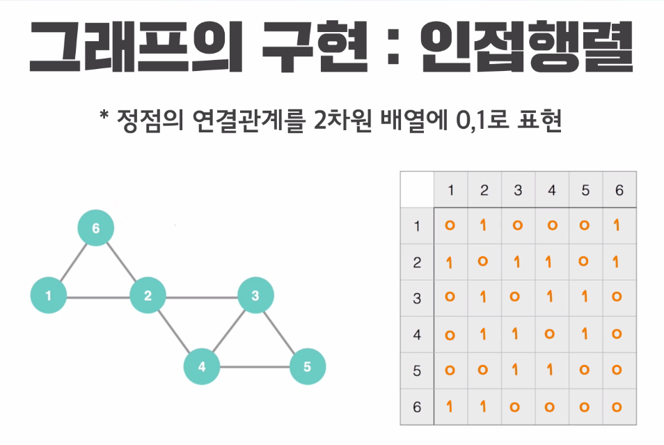

# 그래프

## 1. 구성요소

- 정점(Node) (**V**ertex)
- 간선(**E**dge)
- 차수(Degree) : 한 정점에 붙어있는 간선의 총 갯수
- 사이클(Cycle) : 자기 자신으로 돌아올 수 있는 원형 경로


## 2. 수학적 지식

**2.1. 간선의 갯수는 정점의 제곱보다 작거나 같다**

간선의 최대값은 nC2 이므로 n^2보다 적다.

**2.2. 각 정점의 차수의 합은 간선의 갯수의 2배와 같다.**

total_degree = |V| * 2


## 3. 구현방법 2가지

## 3.1. 인접행렬



**[장점]**

노드n과 노드m 가 연결돼있는가 --> `arr[n][m]` 즉, O(1) 만에 알 수 있다.

**[단점]**

인접한 정점의 수와 관계없이 무조건 O(n)의 탐색을 해서 알 수 있다.

- 위 그림에서 5번 노드에 대해 연결된 노드를 살펴보기위해 행렬에서 5번행에 있는 모든 열을 스캔해야함

무조건  n^2개의 칸을 써야한다.d

- 간선의 수가 적을지라도(연결된 노드가 별로 없을 때) N^2개의 칸을 확보하고 그 값을 많은 0으로 채워야함.


## 4. 구현 코드

## 4.1. 기본코드

```c
#include <iostream>

using namespace std;


// 첫 째줄 (정점의 갯수, 간선의 갯수)
// 그 이후 (정점번호, 연결된 정점)
/*
5 6
1 2
1 3
1 4
2 4
4 5
3 5

	1  ---- 2
	| \    /
	|  \  /
	3    4 
	|  /
	| /
	5

*/

const int MAX = 100;

int main() {
	ios::sync_with_stdio(0);
	cin.tie(0);

	int n, m; // n: 정점의 갯수 , m: 간선의 갯수
	int myGraph[MAX][MAX] = { 0, };

	cin >> n >> m;

	for (int i = 0; i < m; i++) {
		int a, b;
		cin >> a >> b;
		myGraph[a][b] = 1;
		myGraph[b][a] = 1;
	}

	for (int i = 1; i <= n; i++) {
		for (int j = 1; j <= n; j++) {
			cout << myGraph[i][j] << " ";
		}
		cout << endl;
	}

	return 0;
}
```

## 4.2. 기본응용

Q. 정점 X와 Y가 연결이 되어 있는가?

```c
bool isConnected(int myGraph[][MAX], int x, int y) {
	return myGraph[x][y] == 1 ? true : false;
}
```

Q. 정점X와 연결이 되어 있는 모든 정점을 출력하라.

```c
void getAdj(int myGraph[][MAX], int n, int node) {
	for (int i = 1; i <= n; i++) {
		if (myGraph[node][i]) {
			cout << i << " ";
		}
	}
	cout << endl;
}
```


## 4.3. 주의사항

- 노드번호는 1부터 시작하기 때문에 for문의 인덱스를 조심하라

  ```c
  for(int i=1; i<=n; i++){
      ....
  }
  ```

  


## 3.2. 연결리스트

 ```c
int n, m; //정점, 간선
vector<int> myGraph[MAX];
cin >> n >> m;

for (int i = 0; i < m; i++) {
    int a, b;
    cin >> a >> b;
    myGraph[a].push_back(b);
    myGraph[b].push_back(a);
}
 ```

