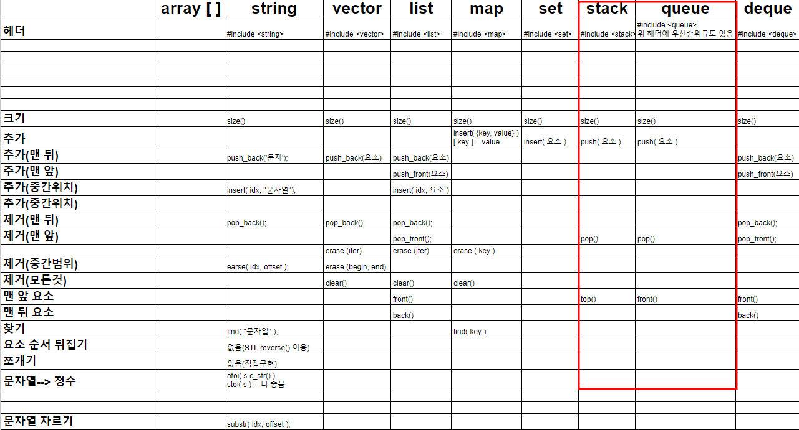

> https://www.youtube.com/watch?v=-TGCT74wFeg&t=1020s
>
> 출처: 코딩테스트 합격자되기 (유튜브, 인프런)

# 스택, 큐



# 스택

- `가장 최근 원소` 활용
- `짝 맞추기`
- `DFS` , `백트래킹`

# 큐

- `줄 서기`
- `요세푸스`
- `BFS`


# 문제풀이

## 영어 끝말잇기 O(N)

https://school.programmers.co.kr/learn/courses/30/lessons/12981

```cpp
#include <iostream>
#include <string>
#include <stack>

using namespace std;

int len; // 입력값 길이
int res; // 정답변수

// 짝짓기실패 여부 O(1)
bool notMatch(char ele, char ch) {
    if (ele == '(' && ch == ')') return false;
    if (ele == '[' && ch == ']') return false;
    if (ele == '{' && ch == '}') return false;
    return true;
}

// 핵심풀이 O(N)
void solve(string &newS) {
    stack<char> stk;
    
    for (int j = 0; j < len; j++) {
        char newCh = newS[j];
        if (newCh == '(' || newCh == '[' || newCh == '{') {
            stk.push(newCh);
        } else if (stk.empty() || notMatch(stk.top(), newCh)) {
            return;
        } else {
            stk.pop();
        }
    }

    if (stk.size() == 0) {
        res++;
    }
}

int solution(string s) {
    len = s.length();
    
    for (int i = 0; i < len; i++) {
        s = s.substr(1) + s[0];
        solve(s);
    }

    return res;
}
```


## 주식가격

https://school.programmers.co.kr/learn/courses/30/lessons/42584


## 영어 끝말 잇기

https://school.programmers.co.kr/learn/courses/30/lessons/12981