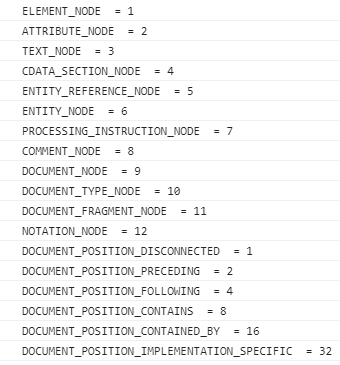

(번역) DOM은 정확히 무엇일까? https://wit.nts-corp.com/2019/02/14/5522


# 1. 노드 개요


## 1.2. 노드 개체 유형

**가장 일번적인 노드**

| 노드유형               | 예                                                           | 정수값 |
| ---------------------- | ------------------------------------------------------------ | ------ |
| DOCUMENT_NODE          | window.document                                              | 9      |
| ELEMENT_NODE           | <body>, <a>, <p>, <script> 등등                              | 1      |
| ATTRIBUTE_NODE         | <div class="ab"> 에서 class="ab"                             | 2      |
| TEXT_NODE              | <p>Hi</p> 에서 HI (줄바꿈과 공백을 포함한 HTML문서 내의 텍스트문자) | 3      |
| DOCUMENT_FRAGMENT_NODE | document.createDocumentFragment()                            | 11     |
| DOCUMENT_TYPE_NODE     | <!DOCTYPE html>                                              | 10     |



​	

- ATTRIBUTE_NDOE는 실제 DOM 트리구조의 일부가 아님(역사적인 이유로 목록에 포함될 뿐)
  - DOM4 에서 사용금지됨
- COMMENT_NODE는 거의 TEXT_NODE와 동일

| 인터페이스 / 생성자                  | nodeType | 예시                   |      |
| ------------------------------------ | -------- | ---------------------- | ---- |
| HTML * Element (예: HTMLBodyElement) | 1        | Element_NODE           |      |
| Text                                 | 3        | TEXT_NODE              |      |
| Attr                                 | 2        | ATTRIBUTE_NODE         |      |
| HTML_Document                        | 9        | DOCUMENT_NODE          |      |
| DocumentFragment                     | 11       | DOCUMENT_FRAGMENT_NODE |      |
| DocumentType                         | 10       | DOCUMENT_TYPE_NODE     |      |


## 1.3. Node 개체로부터 상속받은 하위 노드 개체


```
Object
  └ Node
      ├ Element
      │     └ HTMLElement 
      ├ Attr
      ├ CharacterData
      │     └ Text
      ├ Docuement
      │     └ HTMLDocuement
      └ DocuementFragment        
   
```


## 1.4. 노드를 다루자 (속성 및 메서드)

1. Node

   - 속성
     - childNodes
     - firstChild
     - nextSibling
     - **nodeName**
     - **nodeType**
     - nodeValue
     - parentNode
     - previousSibling

   - 메서드

     - appendChild()

     - cloneNode()

     - compareDocumentPosition()

     - contains()

     - hasChildNodes()

     - insertBefore()

     - isEqualNode()

     - removeChild()

     - replaceChild()

       

2. Document 

   - 메서드
     - document.createElement()
     - document.createTextNode()

3. HTML * Element

   - 속성
     - innerHTML
     - outerHTML
     - textContent
     - innerText
     - outerText
     - firstElementChild
     - lastElementChild
     - nextElementChild
     - previousElementChild
     - children
   - 메서드
     - insertAdjacentHTML()


## 1.6 노드 값 (오직 Text와 Comment를 출력하기 위한 것)

> nodeValue 속성은 Text 와 Comment를 제외하고 null값을 반환함

**(Text, Comment 일 경우)	text 출력**

**(그 외)	null**


<hr>

**참고**

Text, Coment 포함한 경우)  childNodes  -   firstChild

else)                                     children      -   firstElementChild

<hr>


