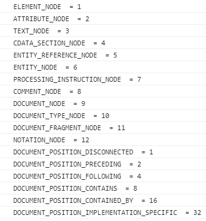

(번역) DOM은 정확히 무엇일까? https://wit.nts-corp.com/2019/02/14/5522

## DOM

> Node개체를 계층화한 트리
>
> 이 트리(DOM)은 인터페이스를 제공한다. 그 목적은 아래를 참고


## DOM의 목적 

> 내부적인 동작방식을 몰라도 `node개체의 정보와 부모자식간 계층` 을 안다면 쉽게 프로그래밍할 수 있음.

- 프로그래밍 : Javascript를 이용해 문서에 대한 스크립트 작성(삭제, 추가, 수정, 이벤트처리)

- 쉽게: 인터페이스 역할

# 1. 노드 개요


## 1.2. 노드 개체 유형

**가장 일번적인 노드**

| 노드유형               | 예                                                           | 정수값 |
| ---------------------- | ------------------------------------------------------------ | ------ |
| DOCUMENT_NODE          | window.document                                              | 9      |
| ELEMENT_NODE           | <body>, <a>, <p>, <script> 등등                              | 1      |
| ATTRIBUTE_NODE         | <div class="ab"> 에서 class="ab"                             | 2      |
| TEXT_NODE              | <p>Hi</p> 에서 HI (줄바꿈과 공백을 포함한 HTML문서 내의 텍스트문자) | 3      |
| DOCUMENT_FRAGMENT_NODE | document.createDocumentFragment()                            | 11     |
| DOCUMENT_TYPE_NODE     | <!DOCTYPE html>                                              | 10     |



​	

- ATTRIBUTE_NDOE는 실제 DOM 트리구조의 일부가 아님(역사적인 이유로 목록에 포함될 뿐)
  - DOM4 에서 사용금지됨
- COMMENT_NODE는 거의 TEXT_NODE와 동일

| 인터페이스 / 생성자                  | nodeType | 예시                    |      |
| ------------------------------------ | -------- | ----------------------- | ---- |
| HTML * Element (예: HTMLBodyElement) | 1        | Element_NODE            |      |
| Text                                 | 3        | TEXT_NODE(COMMENT_NODE) |      |
| Attr                                 | 2        | ATTRIBUTE_NODE          |      |
| HTML_Document                        | 9        | DOCUMENT_NODE           |      |
| DocumentFragment                     | 11       | DOCUMENT_FRAGMENT_NODE  |      |
| DocumentType                         | 10       | DOCUMENT_TYPE_NODE      |      |


## 1.3. Node 개체로부터 상속받은 하위 노드 개체


```
Object
  └ Node
      ├ Element(1)
      │     └ HTMLElement 
      │             └ 겁나많아 (HTML*Element , * 자리에 들어갈 단어: Head, Body, Title, Input, Table, Paragraph, 등등)       ├ Attr
      ├ Attr(2)
      ├ CharacterData
      │     └ Text(3)
      │     └ Comment(8)
      ├ Docuement(9)
      │     └ HTMLDocuement
      ├ Docuement(9)
      └ DocuementFragment        
   
```


## 1.4. 노드를 다루자 (속성 및 메서드)

1. Node

   - 속성
     - childNodes
     - firstChild
     - nextSibling
     - **nodeName**
     - **nodeType**
     - nodeValue
     - parentNode
     - previousSibling

   - 메서드

     - appendChild()

     - cloneNode()

     - compareDocumentPosition()

     - contains()

     - hasChildNodes()

     - insertBefore()

     - isEqualNode()

     - removeChild()

     - replaceChild()

       

2. Document 

   - 메서드
     - document.createElement()
     - document.createTextNode()

3. HTML * Element

   - 속성
     - innerHTML
     - outerHTML
     - textContent
     - innerText
     - outerText
     - firstElementChild
     - lastElementChild
     - nextElementChild
     - previousElementChild
     - children
   - 메서드
     - insertAdjacentHTML()

## 1.5 노드 유형과 이름 식별하기

- **모든 노드는 Node개체로 부터 상속받기 때문에 nodeType과 nodeName 속성을 갖는다.**
- 


## 1.6 노드 값 

## 1.6.1. value값의 종류

| 노드유형          |                                               |
| ----------------- | --------------------------------------------- |
| Text 또는 Comment | nodeValue 값: 텍스트                          |
| div, span, a, p   | nodeValue 값: null                            |
| input, select     | nodeValue 값: null ,      value속성값을 사용. |

- [Q] textContent와 nodeValue의 차이는?

  [A] 아래표 3행에 답이 있음


## 1.6.2.  [ (inner/outer), (Text/HTML) ] , textContent

| **textContent**                                              | **innerText**                                                | innerHTML                                                    |
| ------------------------------------------------------------ | ------------------------------------------------------------ | ------------------------------------------------------------ |
| **Text, Comment노드면)    <br>Node.nodeValue 값을 리턴**     |                                                              | 단순 텍스트를 생성할 거면 권장X<br>HTML파서는 많은 성능악화를 불러옴 |
| **자식요소가 많은 노드면)<br> 각 자식노드들의 Node.nodeValue값을 병합한 값을 리턴** |                                                              |                                                              |
| **<script> <style> 내부의 텍스트들도 포함하여 리턴함**       | **사람이 읽을 수 있는 요소만 리턴<br>hidden처리된 요소는 리턴하지 않음** | HTML태그 전부를 텍스트로 보여줌                              |
| **document와 document_node 타입일 경우 null리턴**            |                                                              |                                                              |
| **XSS공격 위험이 없음**                                      |                                                              |                                                              |

| 메소드명           | 설명                                                         | 사용법                                                    | 특징                                                       |
| ------------------ | ------------------------------------------------------------ | --------------------------------------------------------- | ---------------------------------------------------------- |
| innerHTML          | [create]<br/>1. element와 text 노드 생성<br>2. DOM에 추가(자식노드를 교체) | ${element}.innerHTML = '\<strong>Hi\</strong>'            | 상단 표 참고                                               |
| outerHTML          | [create]<br/>1. element와 text 노드 생성<br>2. DOM에 추가(현 노드까지 교체) |                                                           | [read]<br/>현 노드포함 리턴됨.                             |
| textContent        | [create]<br>1. text노드 생성<br>2. DOM에 추가(자식노드를 교체) | ${element}.textContent = 'Hello'                          | [read]<br/>읽을 수 없는 요소**도** 리턴<br>위 표 1열 참고  |
| innerText          | [create]<br>위 textContent와 동일<br>\<script> 태그노드에서는 동작 안함 | ${element}.innerText = 'Hello'                            | [read]<br/>읽을 수 있는 요소**만** 리턴<br/>위 표 2열 참고 |
| outerText          | [create]<br/>1. text 노드 생성<br/>2. DOM에 추가(현 노드포함 교체됨) |                                                           | [read]<br>위와 동일                                        |
| insertAdjacentHTML | option, string 순으로 파라미터를 받음<br>열린태그 , 닫힌태그를 대상으로 앞 뒤에 노드를 추가할 수 있다 | option종류 : beforebegin, afterbegin, beforeend, afterend | 부모 요소를 갖지 않을 경우<br> 위 1, 4번째 옵션사용 불가   |


## 1.6.3. 자식노드를 선택하는 방법

| 텍스트, 주석을 무시하는 속성 | 텍스트, 주석을 신경쓰는 속성 |
| ---------------------------- | ---------------------------- |
| parentElement                | parentNode                   |
| children                     | childNodes                   |
| firstElementChild            | firstChild                   |
| lastElementChild             | lastChild                    |
| nextElementSibling           | nextSibling                  |
| previousElementSibling       | previousSibling              |

- childElementCount 는 자식요소들의 갯수를 셀 때 유용함.


## 1.7 ElementNode, TextNode 생성 (create * 메소드 사용하여)


### 추가는 1.10 에서 다룸

```js
var elementNode = document.createElement('div');
var textNode = document.createTextNode('Hi');
var commentNode = document.createComment('안녕');
console.log(elementNode, elementNode.nodeType, elementNode.nodeName);
console.log(textNode, textNode.nodeType, textNode.nodeName);
console.log(commentNode, commentNode.nodeType, commentNode.nodeName);

console.dir(elementNode)
console.dir(textNode)
console.dir(commentNode)
/*
createElement('{tagName}')
	1. Element 개체를 생성
	2. Element 개체의 tagName 속성값과 createElementt의 파라미터와 동일하다

createAttribute는 사용금지
	1. 대신 setAttribute, gettAttribute, removeAttribute 를 사용한다

createComment() 메소드도 존재함
*/
```

- `console.log는 요소를 HTML과 같은 트리 구조로 출력합니다.`
- `console.dir은 요소를 JSON과 같은 트리 구조로 출력합니다.`


## 1.10 노드개체 추가하기 

| 메소드                                              | 설명                     | 특징                                                         |
| --------------------------------------------------- | ------------------------ | ------------------------------------------------------------ |
| appendChild(대상노드)                               | 마지막 자식노드로 추가됨 | append() 와 동일한 기능이나 append()는 InterExplorer11에서 불가능하여 잘 안씀 |
| insertBefore(대상노드, 자식노드中 타겟이 되는 노드) |                          |                                                              |
| prepend()                                           |                          |                                                              |
| before()                                            |                          |                                                              |
| after()                                             |                          |                                                              |


## 1.11 노드 제거/교체

> 노드자신.removeChild(자식노드)
>
> 노드자신.replaceChild(새 자식노드, 기존 자식노드)

- 위 두개 메소드는 리턴값으로 제거되는 대상노드 / 교체되는 대상노드 를 리턴한다.
- 또한 이 대상노드들은 위 두 메소드가 실행된 이후에도 접근할 수 있다.

## 1.12 노드 복사

> var clone = 현노드.cloneNode(); // 자기 자신만 복사
>
> var clone = 현노드.cloneNode(true); //자식까지 모두 복사

- 현 노드의 속성값 전부가 복제된다.(인라인 이벤트포함)
- addEventListener() 나 node.onclick 으로 추가된 것은 복제되지 않는다.
- 요소ID도 복사되기 때문에 요소ID가 중복되는 것을 주의하자

## 1.13 노드컬렉션에 대한 이해

배열과 유사하나 배열과 다른 자료구조임

- 라이브상태/정적 일 수 있다
  - 컬렉션내 포함된 노드들은 현재문서/ 스냅샷의 일부일 수 있음
- DOM 트리순서에 따라 정렬되어 컬렉션에 배치된다.
- length속성을 갖음

| 노드컬렉션 유형 | 설명 | 특징 | 예                           |
| --------------- | ---- | ---- | ---------------------------- |
| NodeList        |      |      | document.querySelectorAll(*) |
| HTMLCollection  |      |      | document.scripts             |


## 1.14 직계자식만 선택하기

> childNodes 속성: NodeList 타입
>
> 1.6.3 참고

## 1.15 노드컬렉션을 JS배열로 변환

- JS배열로 변환하는 목적:
  1. DOM에 국한되지 않은 리스트 스냅샷을 만들 수 있게 해준다.
  2. Array개체가 제공하는 매서드를 사용할 수 있다
     - foreach, pop, map, reduce
- Array.prototype.slice() 로 파라미터를 주지 않으면 아무것도 슬라이스하지 않고 배열을 리턴

~~~html
<!DOCTYPE html>
<html lang="en">
<head>
    <meta charset="UTF-8">
    <meta http-equiv="X-UA-Compatible" content="IE=edge">
    <meta name="viewport" content="width=device-width, initial-scale=1.0">
    <title>Document</title>
</head>
<body>
    
<a href=""></a>
<script>
    console.log(Array.isArray(Array.prototype.slice.call(document.links)));
    console.log(Array.isArray(Array.prototype.slice.call(document.querySelector('a'))));
</script>

</body>

</html>
~~~


## 1.16 노트탐색

1.6.3 참고


## 1.17 contain()와 compareDocumentPosition()으로 DOM트리 내의 Node위치를 확인하기

> 조상노드.contains(타겟노드)
>
> 리턴: true / false

> 현재노드.compareDocument(타겟노드)
>
> 리턴값
>
> 0: 동일Element
>
> 1: 동일문서에 없음
>
> 2: 타겟노드가 앞형제
>
> 4: 타겟노드가 뒤형제
>
> 8: 타겟노드가 조상임
>
> 16, 10 : 타겟노드가 자손임


## 1.18 두 노드가 동일한지 여부판단

현노드.isEqualNode(타겟노드)


